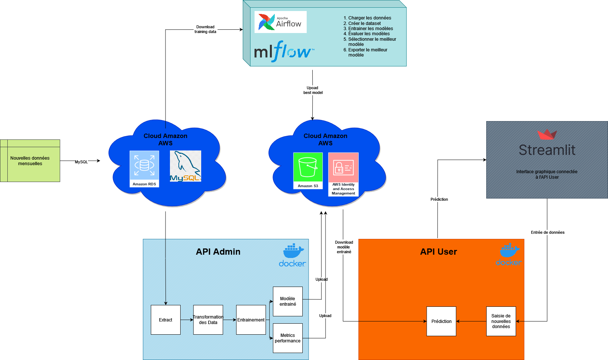

London Fire Brigade Response Time
==============================

This is a MLOps project based on the subject "London Fire Brigade Response Time".
The objective of this project is to analyze and estimate the response times and mobilization of the London Fire Brigade. The London Fire Brigade is the busiest fire and rescue service in the United Kingdom and one of the largest firefighting and rescue organizations in the world.

Project Organization
------------

    ├── JUIN23_CONTINU_MLOPS_POMPIERS    
    │
    ├── .github\workflows
    │     └── python-app.yml
    ├── airflow
    │   ├── config
    │   ├── dags
    │   │   ├── dag_mlops_pompiers.py
    │   │   └── __pycache__
    │   │       └── dag_mlops_pompiers.cpython-38.pyc
    │   ├── docker-compose.yaml
    │   ├── logs
    │   │   ├── dag_id=ALL-model_training_workflow
    │   │   ├── dag_processor_manager
    │   │   │   └── dag_processor_manager.log
    │   │   └── scheduler
    │   │       └── 2023-10-27
    │   │           ├── dag_mlops_pompiers.py.log
    │   │           └── native_dags
    │   │               └── example_dags
    │   ├── mlflow
    │   │   └── null_file.json
    │   ├── models
    │   │   └── null_file.json
    │   └── plugins
    ├── docker-compose.yml
    ├── LICENSE
    ├── models
    ├── notebooks
    │   ├── 1.0-wm-data-exploration-and-testing-models.ipynb
    │   ├── 2.0-wm-data-exploration-and-testing-models.ipynb
    │   ├── 2.1-wm-testing-models-features-selection.ipynb
    │   └── 2.2-wm-random-forest-features-selection.ipynb
    ├── README.md
    ├── references
    │   ├── Cahier des charges LFB.docx
    │   ├── Diagram-MLOps-pompiers
    │   ├── Diagram-MLOps-pompiers.drawio.png
    │   ├── Metadata
    │   │   ├── Incidents Metadata.xlsx
    │   │   └── Mobilisations Metadata.xlsx
    │   └── Prédiction du temps de réponse des pompiers.docx
    ├── requirements.txt
    ├── src
    │   ├── api_admin
    │   │   ├── api
    │   │   │   ├── __init__.py
    │   │   │   ├── schema.py
    │   │   │   └── users.py
    │   │   ├── api_admin.py
    │   │   ├── data
    │   │   │   ├── import_raw_data.py
    │   │   │   ├── __init__.py
    │   │   │   ├── make_dataset.py
    │   │   ├── Dockerfile
    │   │   ├── models_training
    │   │   │   ├── __init__.py
    │   │   │   ├── model.py
    │   │   ├── requirements.txt
    │   │   ├── test_api_admin.py
    │   │   └── tests
    │   │       ├── __init__.py
    │   │       ├── test_import_raw_data.py
    │   │       └── test_model.py
    │   └── api_user
    │       ├── api
    │       │   ├── fonction.py
    │       │   ├── __init__.py
    │       │   ├── schema.py
    │       │   └── users.py
    │       ├── api_user.py
    │       ├── data
    │       │   ├── import_raw_data.py
    │       │   ├── __init__.py
    │       │   ├── make_dataset.py
    │       ├── Dockerfile
    │       ├── models_training
    │       │   ├── __init__.py
    │       │   └── model.py
    │       ├── requirements.txt
    │       └── test_api_user.py
    └── streamlit_app
        ├── app.py
        ├── assets
        ├── blason_LFB_1.png
        ├── Dockerfile
        ├── Image panier.png
        ├── requirements.txt
        ├── style.css
        └── tabs
            ├── credits.py
            ├── intro.py
            ├── pred_time.py

--------

Context
------------

The London Fire Brigade (LFB) is the largest fire service in the world with 103 stations and over 5000 professional firefighters. The Brigade covers the 13 boroughs of London, which is home to 8 million residents. The Brigade responds to between 100,000 and 130,000 emergency calls each year and operates in a territory of 1587 square kilometers.

In cases of life-threatening emergencies, every lost minute diminishes the chances of survival or increases the risk of lasting consequences. Regarding fires, a famous saying goes: the first minute, a fire can be extinguished with a glass of water, the second with a bucket, and the third with a tanker! It is therefore crucial for firefighters to reach the site as quickly as possible.

In this context, it would be beneficial for the brigade, especially for the call center, to anticipate and predict the intervention time of firefighters following a call. This would help reassure those calling for help, better optimize the logistics of emergency services, or challenge the organization of departure and routes to further reduce the response time to emergencies

------------

Data
------------

For the completion of this project, we utilized the data from these two datasets: <a target="_blank" href="https://data.london.gov.uk/dataset/london-fire-brigade-incident-records">LFB's data for incidents </a> and <a target="_blank" href="https://data.london.gov.uk/dataset/london-fire-brigade-incident-records">LFB's data for mobilisations </a>.</small>

These data are provided to us by The London Datastore which is  a free and open data-sharing portal where anyone can access data relating to the capital of London. 

------------

Project Diagram
------------

------------

Application Operation
------------

**APIs :**

The application consists of two APIs built with FastAPI:
- API User :
The User API is available on port 8001.
It allows the user to 
    -  get a prediction of the time between the moment of the emergency call and the arrival of the first firefighting forces at the incident scene. 

- API Admin :
The Admin API is available on port 8002. 
It allows the admin to
    - consult the database structure
    - get a sample of data from the database
    - train a model
    - get metrics for a model

**Amazon AWS :**

The application uses Amazon AWS cloud services, including : 
- RDS : For the MySQL database
- S3 : To store various models, metrics, label encoders fitted to training data, and Min/Max scalers fitted to training data.

**Airflow / MLflow :**

Airflow is a tool designed to automate tasks, and we leverage it to automatically load new data, retrain various models, and subsequently export the best model to be reused in the API. Additionally, we use MLflow to gain deeper insights and more detailed tracking of model metrics and outcomes based on their parameters. Both services can be accessed through browser interfaces.

The automation script for Airflow is called a DAG and is located in the 'dag' folder of the 'airflow' directory.
We provide further details on the implementation of these services below.

**Streamlit :**

A Streamlit interface has been created for the user to facilitate testing of the application.
The Streamlit App is available on port 8501.

------------

How to use it ?
------------
After cloning the repository to your machine, run the following command:

`docker compose up -d`

In your browser, you will have access to the 3 services:
- **api_admin** at the address **localhost:8002**
- **api_user** at the address **localhost:8001**
- **streamlit_app** at the address **localhost:8501**

To access Airflow and MLFlow, run the following commands:

`cd airflow`

`echo -e "AIRFLOW_UID=$(id -u)\nAIRFLOW_GID=0" > .env`

`docker-compose up -d`

In your browser, you will have access to the 3 services:
- **airflow** at the address **localhost:8080**
- **mlflow** at the address **localhost:5001**

------------

